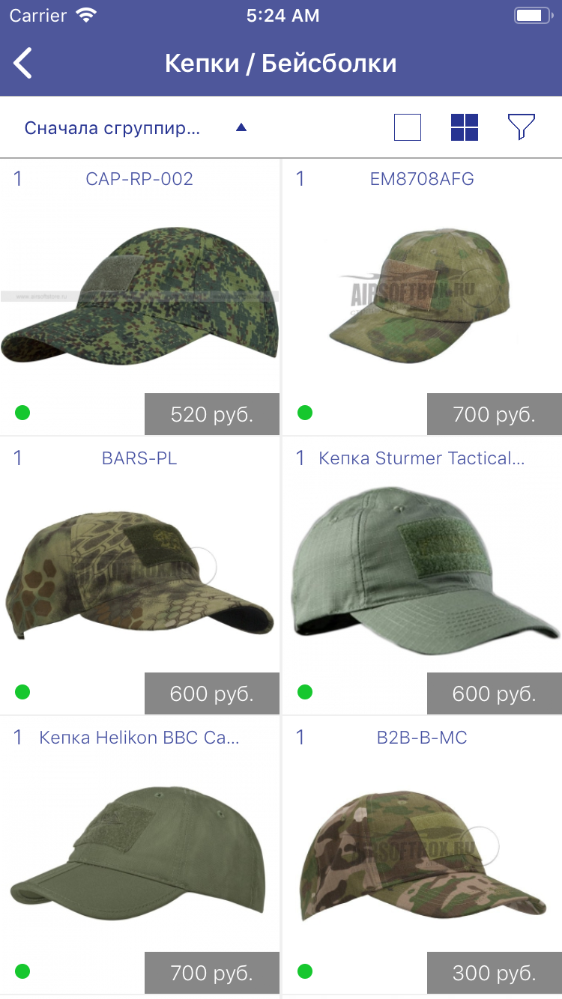
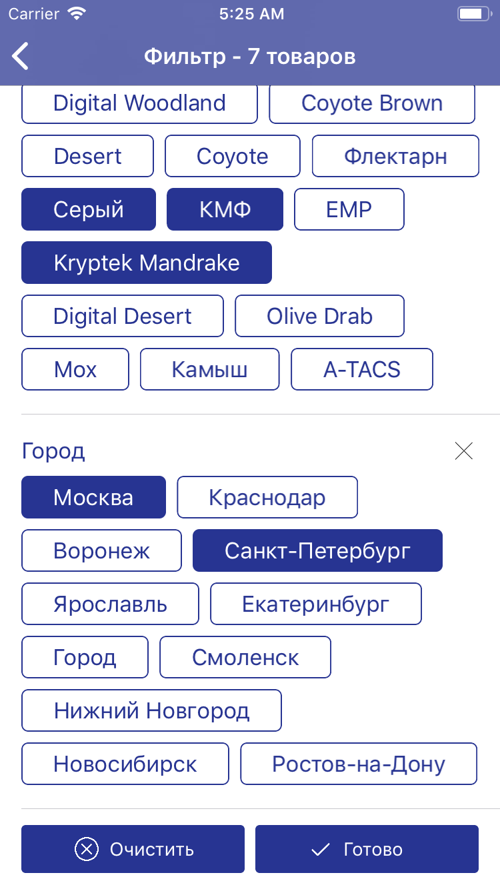
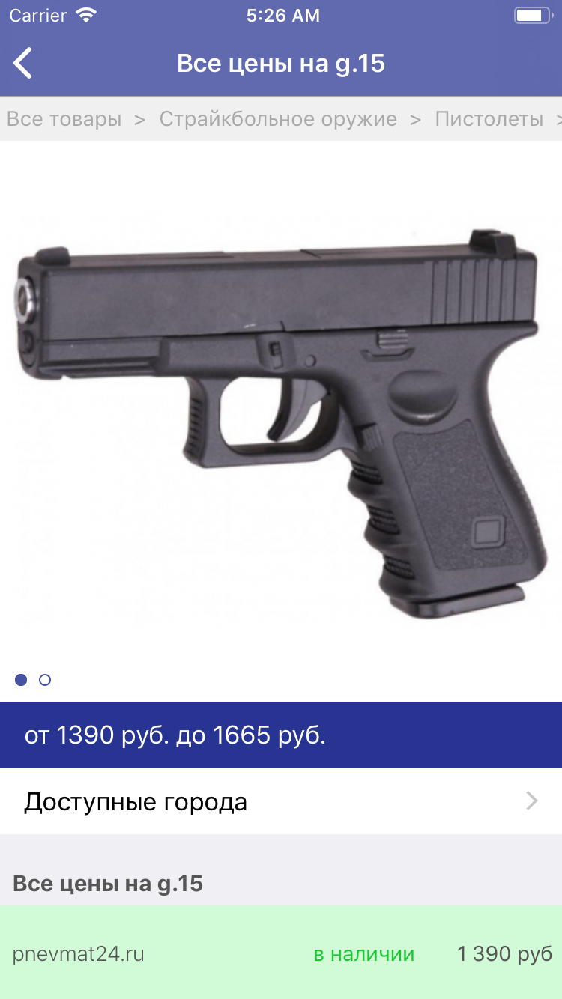
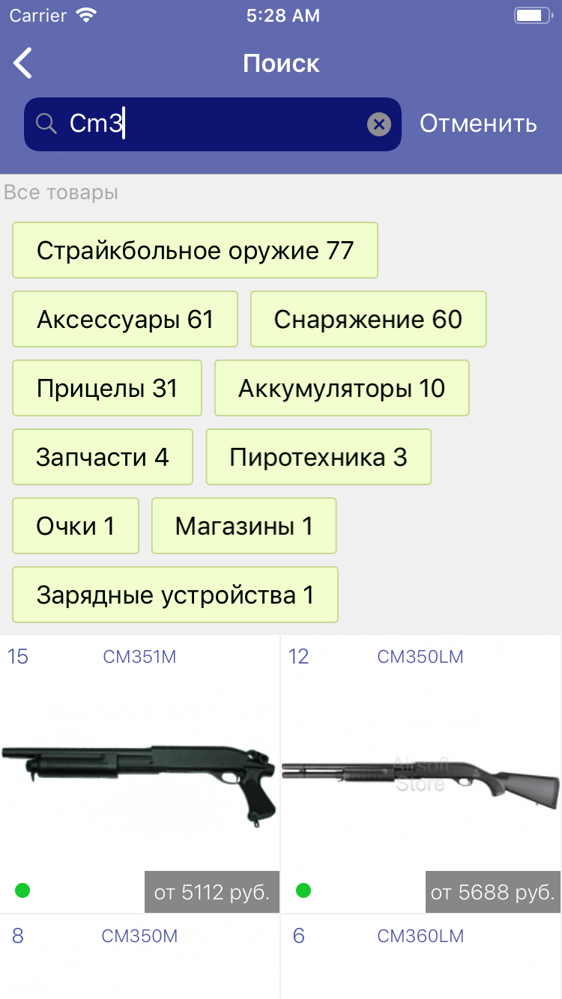

# 020g-iOS-client

The application is a client of an aggregator of airsoft equipment sellers for iOS.
It works via RESTful API, uses Swift 4.2 and is available for devices with iOS => 9.0.

### Interface

UI is written using Autolayout withous interface builders.

### Data

* All data is fetching from server
* Requests are handled via `URLSessions`
* JSON is handled via models using the `Codable` protocol and `JSONSerialization`
* Images is caching

### Connecting the Data with the Interface

It uses MVC and MVVM architecture.
